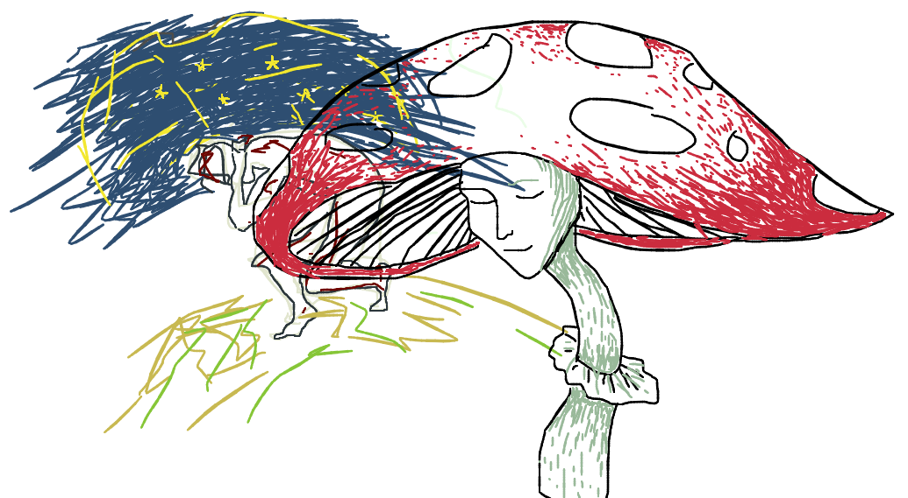

# Atrament

**A small JS library for beautiful drawing and handwriting on the HTML Canvas**

---



[](https://travis-ci.org/jakubfiala/atrament.js)

Atrament is a library that enables the user to draw smooth, natural drawings and handwriting on the HTML canvas.
The algorithm was originally developed about 2 weeks after I started learning JavaScript, as I wanted to build a
collaborative drawing space on the web, which ended up being [1WALL](http://fiala.uk/1wall). I wanted the drawing to
feel natural and comfortable, and the result to be smooth and pleasing. Years later, I've taken the algorithm,
improved it, rewrote it in ES6 and made it into a neat little library.

**FEATURES:**

- Draw/Fill/Erase modes
- Adjustable adaptive smoothing
- Events tracking the drawing - this allows the app to "replay" or reconstruct the drawing, e.g. for undo functionality
- Adjustable line thickness and colour

[Here's a basic demo.](http://fiala.uk/atrament.js/demo/)

Enjoy!

- [Atrament](#atrament)
  - [Installation](#installation)
      - [as a module](#as-a-module)
      - [script tag](#script-tag)
      - [polymer](#polymer)
  - [Usage](#usage)
  - [Options & config](#options--config)
  - [Events](#events)
    - [Dirty/clean](#dirtyclean)
    - [Stroke start/end](#stroke-startend)
    - [Fill start/end](#fill-startend)
    - [Stroke recording](#stroke-recording)
  - [Programmatic drawing](#programmatic-drawing)
  - [Development](#development)

## Installation

#### as a module

If you're using a tool like webpack or browserify to bundle your code, you can install it using npm.

- install atrament as a dependency using `npm install --save atrament`.
- You can access the Atrament class using `import { Atrament } from 'atrament';`

#### script tag

Include the script located at [dist/atrament.min.js](https://github.com/jakubfiala/atrament.js/raw/master/dist/atrament.min.js) in the `<head>` tag of your HTML.

Alternatively, you can use Bower: `bower install atrament` and include `bower_components/atrament/dist/atrament.min.js` as a script tag.

#### polymer

Thanks to [rubenstolk](https://github.com/rubenstolk), you can also use the [sc-atrament](https://github.com/safetychanger/sc-atrament) Polymer element.

## Usage

- create a `<canvas>` tag, e.g.:

```html
<canvas id="sketchpad" width="500" height="500"></canvas>
```

- in your JavaScript, create an `Atrament` instance passing it your canvas object:

```js
import { Atrament } from 'atrament';

const canvas = document.querySelector('#sketchpad');
const sketchpad = new Atrament(canvas);
```

- you can also pass the width, height and default colour to the constructor:

```js
const sketchpad = new Atrament(canvas, {
  width: 500,
  height: 500,
  color: 'orange',
});
```

- that's it, happy drawing!

## Options & config

- clear the canvas:

```js
sketchpad.clear();
```

- change the line thickness:

```js
sketchpad.weight = 20; //in pixels
```

- change the color:

```js
sketchpad.color = '#ff485e'; //just like CSS
```

- toggle between modes:

```js
sketchpad.mode = 'erase'; // eraser tool
sketchpad.mode = 'fill'; // click to fill area
sketchpad.mode = 'draw'; // default
sketchpad.mode = 'disabled'; // no modification to the canvas (will still fire stroke events)
```

- tweak smoothing - higher values make the drawings look much better, lower values make drawing feel a bit more responsive. Set to `0.85` by default.

```js
sketchpad.smoothing = 1.3;
```

- toggle adaptive stroke, i.e. line width changing based on drawing speed for a more natural effect. `true` by default.

```js
sketchpad.adaptiveStroke = false;
```

- record stroke data (enables the `strokerecorded` event). `false` by default.

```js
sketchpad.recordStrokes = true;
```

- export as image:

```js
//we have to get the dataURL of the image
const dataURL = sketchpad.toImage();
//then we can, for instance, open a new window with it
window.open(dataURL);
```

## Events

### Dirty/clean

These events fire when the canvas is first drawn on, and when it's cleared.
The state is stored in the `isDirty` property.

```js
sketchpad.addEventListener('dirty', () => console.info(sketchpad.isDirty));
sketchpad.addEventListener('clean', () => console.info(sketchpad.isDirty));
```

### Stroke start/end

These events don't provide any data - they just inform that a stroke has started/finished.

```js
sketchpad.addEventListener('strokestart', () => console.info('strokestart'));
sketchpad.addEventListener('strokeend', () => console.info('strokeend'));
```

### Fill start/end

These only fire in fill mode. The `fillstart` event also contains `x` and `y` properties
denoting the starting point of the fill operation (where the user has clicked).

```js
sketchpad.addEventListener('fillstart', ({ x, y }) =>
  console.info(`fillstart ${x} ${y}`),
);
sketchpad.addEventListener('fillend', () => console.info('fillend'));
```

### Stroke recording

`strokerecorded` fires at the same time as `strokeend` and contains data necessary for reconstructing the stroke.
`pointdrawn` fires during stroke recording every time the `draw` method is called. It contains the same data as `strokerecorded`.

```js
sketchpad.addEventListener('strokerecorded', ({ stroke }) =>
  console.info(stroke),
);
/*
{
  points: [
    {
      point: { x, y },
      time,
    }
  ],
  color,
  weight,
  smoothing,
  adaptiveStroke,
}
*/
sketchpad.addEventListener('pointdrawn', ({ stroke }) =>
  console.info(stroke),
);
```

## Programmatic drawing

To enable functionality such as undo/redo, stroke post-processing, and SVG export in apps using Atrament, the library
can be configured to record the "pen strokes".

The first step is to enable `recordStrokes`, and add a listener for the `strokerecorded` event:

```js
atrament.recordStrokes = true;
atrament.addEventListener('strokerecorded', ({ stroke }) => {
  // store `stroke` somewhere
});
```

The stroke can then be reconstructed using methods of the `Atrament` class:

```js
// set drawing options
atrament.mode = stroke.mode;
atrament.weight = stroke.weight;
atrament.smoothing = stroke.smoothing;
atrament.color = stroke.color;
atrament.adaptiveStroke = stroke.adaptiveStroke;

// don't want to modify original data
const points = stroke.points.slice();

const firstPoint = points.shift().point;
// beginStroke moves the "pen" to the given position and starts the path
atrament.beginStroke(firstPoint.x, firstPoint.y);

let prevPoint = firstPoint;
while (points.length > 0) {
  const point = points.shift().point;

  // the `draw` method accepts the current real coordinates
  // (i. e. actual cursor position), and the previous processed (filtered)
  // position. It returns an object with the current processed position.
  const { x, y } = atrament.draw(point.x, point.y, prevPoint.x, prevPoint.y);

  // the processed position is the one where the line is actually drawn to
  // so we have to store it and pass it to `draw` in the next step
  prevPoint = { x, y };
}

// endStroke closes the path
atrament.endStroke(prevPoint.x, prevPoint.y);
```

## Development

To obtain the dependencies, `cd` into the atrament directory and run `npm install`.
You should be able to then build atrament by simply running `npm run build`.

I didn't bother writing tests because it's such a small package. Contributions are welcome!
